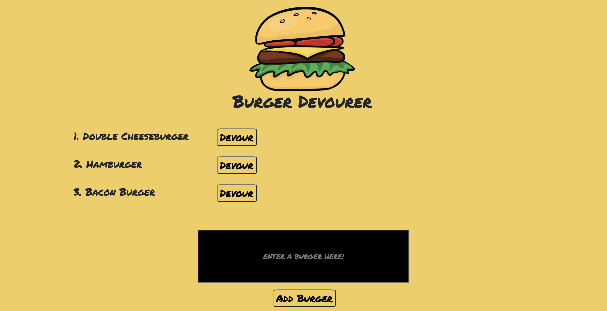
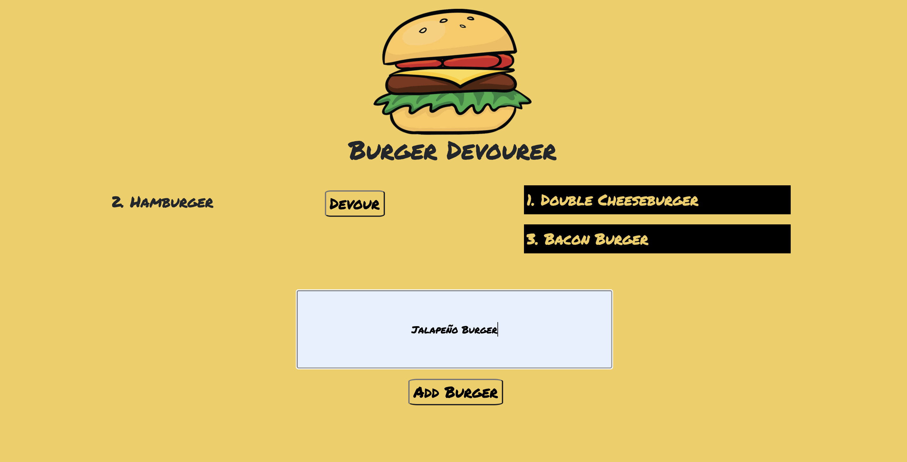
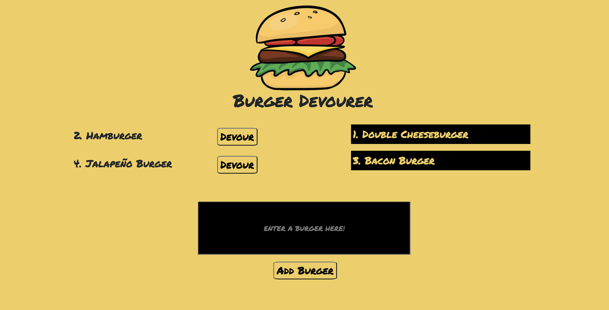
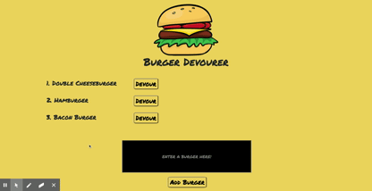

# burger-devourer-app

In this assignment, we created a burger logger application with MySQL, Node, Express, Handlebars and a custom ORM. MVC design architecture is used throughout and HTML is served dynamically through Express-Handlebars.

* Burger Devourer is a restaurant app that lets users input the names of burgers they'd like to eat.

* Whenever a user submits a burger's name, the burger on the left side of the page -- waiting to be devoured.

* Each burger in the waiting area also has a `Devour it!` button. When the user clicks it, the burger will move to the right side of the page.

* Every burger is stored on a SQL Database

## Installation

This App is deployed to Heroku [HERE](https://burger-devourer-app-102020.herokuapp.com/).

 However, if users wish to clone this repository themselves, they can see the below instructions.

Users that clone this repository into their local environments should be able to edit the `connection.js` file in their `configs folder` to run to their own local server and database (using the `seeds.sql` and `schema.sql` folders to create their database). 

Note that if users would like to deploy this app to heroku, they will need create use `JAWSDB` from Heroku and initialize an instance in their SQL workbench by following the instructions laid out on Heroku's website.

## Images & Demo
 

 

 

 

#### DEMO

## Contributors

This project was completed as assignment toward my certification with the __Georgia Tech Coding Boot Camp__. 

I completed with the review and guidance of my tutor.

## License
This project is covered under the MIT license 

## Links
* [Video Link](https://drive.google.com/file/d/1LwxdlU3qz8KlriV37px5FqnM-mJ73SuM/view)
* [Repository](https://drive.google.com/file/d/1LwxdlU3qz8KlriV37px5FqnM-mJ73SuM/view)
* [Deployed Site](https://burger-devourer-app-102020.herokuapp.com/)

